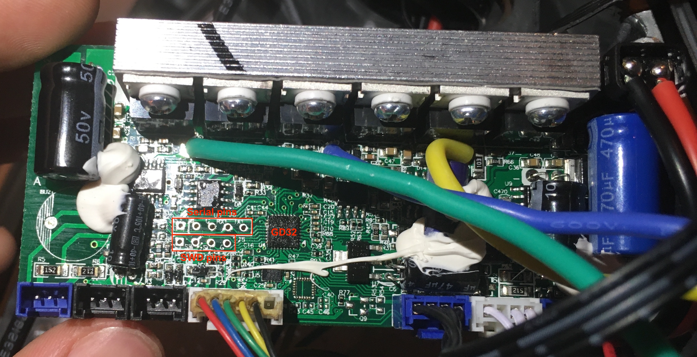
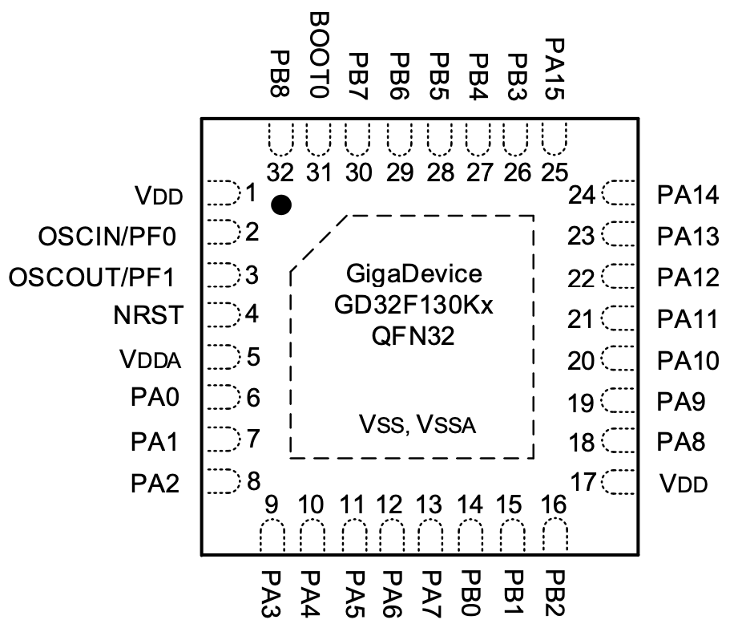
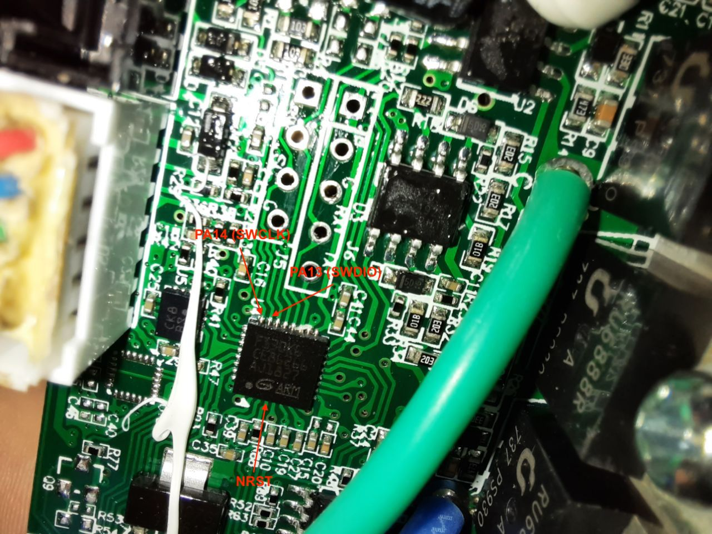
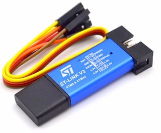

# GD32 F130K6 Hoverboard hack

This repository shows the steps to unlock the hoverboard sideboards and flash a firmware. No firmware is included, but the amazing work from [EmanuelFeru](https://github.com/EmanuelFeru?tab=repositories) can be reused.

## Identifying the hoverboard

Multiple different hoverboard models exist, you should find the right repository for your device.

* For older models with only one motherboard, see [the FOC repository](https://github.com/EmanuelFeru/hoverboard-firmware-hack-FOC),
* For models with 2 sideboards, the chip must be identified:
  * If the chip is an STM32 (see [this picture](https://raw.githubusercontent.com/EmanuelFeru/hoverboard-sideboard-hack-STM/master/docs/pictures/sideboard_pinout.png)), follow the [STM repository](https://github.com/EmanuelFeru/hoverboard-sideboard-hack-STM).
  * If the chip is a GD32 F130C6 (see [this picture](https://raw.githubusercontent.com/EmanuelFeru/hoverboard-sideboard-hack-GD/master/docs/pictures/sideboard_pinout.png)), follow the [GD repository](https://github.com/EmanuelFeru/hoverboard-sideboard-hack-GD),
  * If the chip is a GD32 F130K6 (see [the open hoverboard](images/open_hoverboard.jpg), [the sideboard](images/sideboard.jpg), and [a closeup of the chip](images/GD32F130K6_chip.jpg)), continue reading.

## Hardware

The sideboard has a 4-pin debugging header with a 3V3, SWDIO, SWCLK, and GND input accessible next to the chip:



The chip itself is a GD32 F130K6, for which you can find a datasheet [here](doc/GD32F130xx_Datasheet_Rev3.1.pdf):

<p float="left">
  
  
</p>

**Important:** The "dot" on the datasheet's schematics used to indicate the orientation is located at the *bottom left* of the chip when the text is upright, contrary to what you might expect.

Here are some of the pins located on a real board:



Since the 3V3, GND, SWDIO and SWCLK are already connected to the debugging header, there is no need to bother with them. However, correctly identifying the NRST pin is important to unlock the board.

## Flashing

For this setup, you can completly disconnect the sideboards from the rest of the equipment, including the battery. You must have access to an ST-LINK v2 like the following:



Connect the 3V3, SWDIO, SWCLK, and GND pins from the ST-LINK to the debugging header on the sideboard.

### Unlocking

If this is your first time flashing the board, it must be unlocked.

At this points, you can plug the ST-LINK in your computer and use [ST-LINK utility](https://www.st.com/en/development-tools/stsw-link004.html) to connect to it. However, the GD32 itself will most likely not respond, resulting in an error. You can try [EmanuelFeru's tutorial](https://github.com/EmanuelFeru/hoverboard-firmware-hack-FOC/wiki/How-to-Unlock-MCU-flash) on how to unlock it. If this works, good for you, you can skip the rest of these steps! Otherwise, keep on reading.

Now, the NRST pin must be taken care of. Because it is not connected to the debugging header, you need to find a way to manually connect a cable. It is considerably easier to access the transistor to which the pin is connected than the pin itself, as it is bigger and there is less risk of creating a short.

The ST-LINK has an RST pin that we'd like to connect to our GD32. However, its output must be inverted before being connected to the NRST pin. To do this, we used an Arduino Mega with a very simple program:

```C
void setup() {
  pinMode(40, INPUT);
  pinMode(A0, OUTPUT);
}

void loop() {
  int rst = digitalRead(40);
  analogWrite(A0, 1023 * !rst);
}
```

Because the output is 5.5V, and we can't use PWM considering our use case, we added a simple voltage divider to match the GD32's expected 3.3V amplitude on the NRST pin.

**Note:** The same result could be achieved in an easier fashion by using simple transistors, but we used what was handy. It would also probably reduce the delay between the ST-LINK and the GD32, which might make the whole procedure more reliable.

Here's a look at our quick and dirty setup:


Now that the 3V3, SWDIO, SWCLK, GND, and NRST pins are connected, we can try unlocking the GD32.

We used [OpenOCD](http://openocd.org) to launch commands and check if our reset was working correctly:

```bash
./openocd -f interface/stlink-v2.cfg -f target/stm32f1x.cfg -c init -c "reset halt" -c "stm32f1x unlock 0" -d
```

**Note:** If you're running Windows, you might need to start `cmd` as administrator to access the USB ports. On Linux / macOS, `sudo` might be necessary, but the error messages should be clear enough to figure it out.

The first few times, we ran into errors such as:

```
Error: init mode failed (unable to connect to the target) 
```

```
stlink_usb.c:515 jtag_libusb_bulk_transfer_n(): ERROR, transfer 0 failed, error -1
stlink_usb.c:515 jtag_libusb_bulk_transfer_n(): ERROR, transfer 1 failed, error -1
```

```
stlink_usb.c:1679 stlink_usb_idcode(): IDCODE: 0xFFFFFFFF
hla_interface.c:93 hl_interface_init_target(): UNEXPECTED idcode: 0xffffffff
hla_interface.c:95 hl_interface_init_target(): expected 1 of 1: 0x1ba01477
```

```
stlink_usb.c:788 stlink_usb_error_check(): unknown/unexpected STLINK status code 0x5
```

However, we were able to successfully run the OpenOCD command with the following procedure:

* Unplug the ST-LINK from your computer so the GD32 is unpowered.
* Plug the NRST pin with the inverter setup.
* Powerup the ST-LINK by plugging it to your computer and wait a few seconds.
* Run the command. Unplug the NRST pin. Run the command again.

If it works, OpenOCD shouldn't exit and you should be able to spot the following message:

```
options.c:63 configuration_output_handler(): stm32x unlocked.
```

If that doesn't work, you can try the same steps but by disconnecting the NRST pin before running the command the first time (and making sure you wait a few seconds holding it in after plugging the ST-LINK).

It that still doesn't work, try playing with the timing at which you unplug the NRST pin (right after launching the OpenOCD command, after a small delay...). In our experience, that was unnecesary as the previous procedure worked correctly.

Once you're able to run the OpenOCD command, you can follow [EmanuelFeru's tutorial](https://github.com/EmanuelFeru/hoverboard-firmware-hack-FOC/wiki/How-to-Unlock-MCU-flash) using ST-Link utility if need-be (your GD32 may already be unlocked thanks to the OpenOCD command). Make sure to stop OpenOCD before following the tutorial or both programs might conflict with one another.

**Note:** Unlocking your GD32 only needs to be done once. Afterwards, you no longer need to fiddle with the NRST pin and the whole inverter: the 3V3, SWDIO, SWCLK, and GND pins should be enough.

### Flashing

The hard part is done, now you're in known territory. The easiest was of doing things is following [EmanuelFeru's tutorial](https://github.com/EmanuelFeru/hoverboard-sideboard-hack-GD#flashing) with the associated firmware.

## Resources

* [EmanuelFeru's hoverboard repository](https://github.com/EmanuelFeru/hoverboard-sideboard-hack-GD).
* [Hooover Telegram group](https://t.me/joinchat/BHWO_RKu2LT5ZxEkvUB8uw).
* [Phil Malone's "Hoverboards for Assistive Devices" post](https://hackaday.io/project/170932-hoverboards-for-assistive-devices).

## Special thanks

* Candas for their help on handling the GD32 chip.
* Emanuel Feru for their amazing work on different boards.
* All the folks at [Hooover](https://t.me/joinchat/BHWO_RKu2LT5ZxEkvUB8uw) for their advice and ideas.
